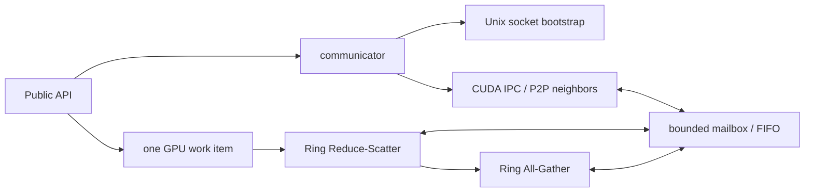

# tiny-nccl

`tiny-nccl` 是 NCCL 的一条可读、以可运行闭环为目标的纵向切片：保留一次 collective 从 communicator 初始化、邻居连接、GPU Ring 到有界 FIFO 同步的完整因果链，删除生产级 NCCL 为硬件覆盖、性能调优和兼容性承担的复杂度。

它与 `llama2.c`、`nano-vllm`、`mini-sglang` 的定位相同：不是 API 包装器，也不追求功能子集的数量；它用最少代码保留原项目最值得掌握的执行机制。

## v0.1 范围

- 单机、多进程，一 rank 一 GPU。
- `FP32 SUM AllReduce`。
- 单 channel、固定 rank 顺序的 Ring Reduce-Scatter + All-Gather。
- Unix domain socket 只负责 bootstrap；tensor 数据只走 CUDA IPC/P2P。
- 固定大小、可复用的 GPU mailbox/FIFO；通信内存不随 tensor 大小线性增长。
- collective 异步排入用户给定的 CUDA stream。

构建基线为 CUDA 12、C++17 和 `sm_70+`；实际 CUDA 机器应通过
`CMAKE_CUDA_ARCHITECTURES` 显式指定目标 GPU 架构。相邻 P2P 边必须支持
CUDA native peer atomics，否则初始化明确返回 unsupported。

## 环境与构建

前置条件：Linux、CMake 3.24+、支持 C++17 的编译器。GPU 路径还需要 CUDA 12、`sm_70+` GPU，以及 ring 每条相邻边上的 CUDA P2P 和 native peer atomics。源码使用 Linux 专有的 Unix socket 能力，其他操作系统不在 v0.1 范围内。

CPU-only 构建只生成算法模型测试，不生成 `tiny_nccl` 库和 GPU example：

```bash
cmake -S . -B build-cpu \
  -DCMAKE_BUILD_TYPE=Debug \
  -DTNCCL_BUILD_CUDA=OFF \
  -DTNCCL_BUILD_EXAMPLES=OFF \
  -DTNCCL_BUILD_TESTS=ON
cmake --build build-cpu
ctest --test-dir build-cpu --output-on-failure
```

GPU 构建和 smoke example；下面的 `80` 应替换为实际 GPU 的 architecture：

```bash
cmake -S . -B build-gpu \
  -DCMAKE_BUILD_TYPE=Debug \
  -DTNCCL_BUILD_CUDA=ON \
  -DTNCCL_BUILD_EXAMPLES=ON \
  -DTNCCL_BUILD_TESTS=ON \
  -DCMAKE_CUDA_ARCHITECTURES=80
cmake --build build-gpu
CUDA_VISIBLE_DEVICES=0 timeout 60s ./build-gpu/tnccl_allreduce 1 1048576
CUDA_VISIBLE_DEVICES=0,1 timeout 60s ./build-gpu/tnccl_allreduce 2 1048576
```

example 固定把进程 rank 映射到其可见设备序号；所有 rank 必须继承相同的 `CUDA_VISIBLE_DEVICES` 顺序。它支持 `count=0` 的空控制轮。`TNCCL_BUILD_CUDA=ON` 但找不到 CUDA compiler 时配置会直接失败，因此 CPU-only 场景必须显式传 `TNCCL_BUILD_CUDA=OFF`。

## 调用与生命周期约束

- `nranks>1` 时，communicator 初始化和销毁都是所有 rank 必须按相同顺序参与的 blocking collective。
- bootstrap Unix socket 是生命周期控制通道：初始化后继续保留，用于销毁时协调 IPC importer 先关闭、exporter 后释放；tensor 数据从不经过它。
- 同一 communicator 只允许一个 host thread，并在第一次 AllReduce 后绑定一个 CUDA stream。所有 rank 必须以相同顺序和相同 `count` 提交 collective。
- AllReduce 成功只表示工作已 enqueue。send/recv buffer 必须存活到该 stream 完成对应工作；绑定的 stream 必须存活到 `tncclCommDestroy` 返回。
- `tncclCommDestroy` 会同步绑定 stream，并通过两阶段 rank barrier 安全释放 CUDA IPC 资源，因此它可能阻塞。
- v0.1 没有 GPU-visible runtime abort。rank 缺失、peer 退出、collective 次序或 `count` 不一致属于契约违反，可能让 kernel 等待不返回；测试和 example 应始终使用外部进程 timeout。

## 实现与验证状态

| 项目 | 当前状态 |
|---|---|
| v0.1 API、bootstrap、CUDA IPC/P2P Ring 与有界 FIFO 源码 | 已落地；仅静态审查 |
| CPU Ring model 测试 | 已落地；Apple Clang 17 严格告警构建并通过（未通过 CMake） |
| CUDA 编译与 L2 单卡验证 | 未验证 |
| L3 单机多卡正确性、内存序与死锁验证 | 未验证；它是 v0.1 验收门槛 |
| v0.2 Socket 数据面与 CPU proxy | 仅设计，尚未实现 |

初始实现环境记录为没有 `cmake`、`nvcc` 和可用 GPU；本轮仅以系统 C++ 编译器运行了纯 CPU Ring/ticket 模型。CUDA 库尚未编译，单卡和多卡均未验证，因此当前不能声称 v0.1 已完成，更没有性能结论。



明确不做：NCCL ABI 兼容、算法/协议自动选择、多 channel、拓扑搜索、运行时调优、generic transport framework、group scheduler、datatype/reduction 矩阵、网络 fallback、插件、profiling 与 RAS。

## 版本路线

- [v0.1 设计](docs/design-v0.1.md)：单机多进程 CUDA IPC/P2P Ring。
- [v0.2 设计](docs/design-v0.2.md)：在真实需求出现时直接加入跨节点 Socket 数据面和 CPU proxy 闭环，不预造 transport 抽象。
- [验证策略](docs/validation.md)：CPU、单卡、单机多卡和多节点各自能证明什么。

## 设计原则

1. 一条主路径优先于很多半成品功能。
2. 一个维度只有一个实现时，不为它创建接口层或工厂。
3. 有界通信缓冲、单调 ticket、stream 顺序是核心，不是实现细节。
4. 不支持的拓扑和调用方式显式报错，不做隐式降级。
5. 每个模块都应能对应到 NCCL 中一个真实职责，但不复制其生产级框架。

本项目采用 [Apache License 2.0](LICENSE)。
