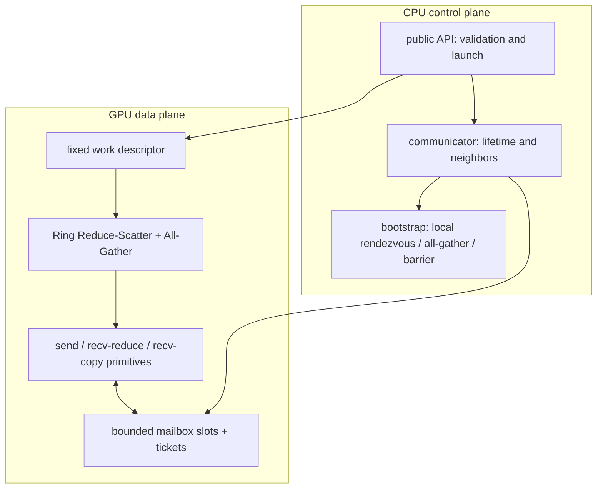
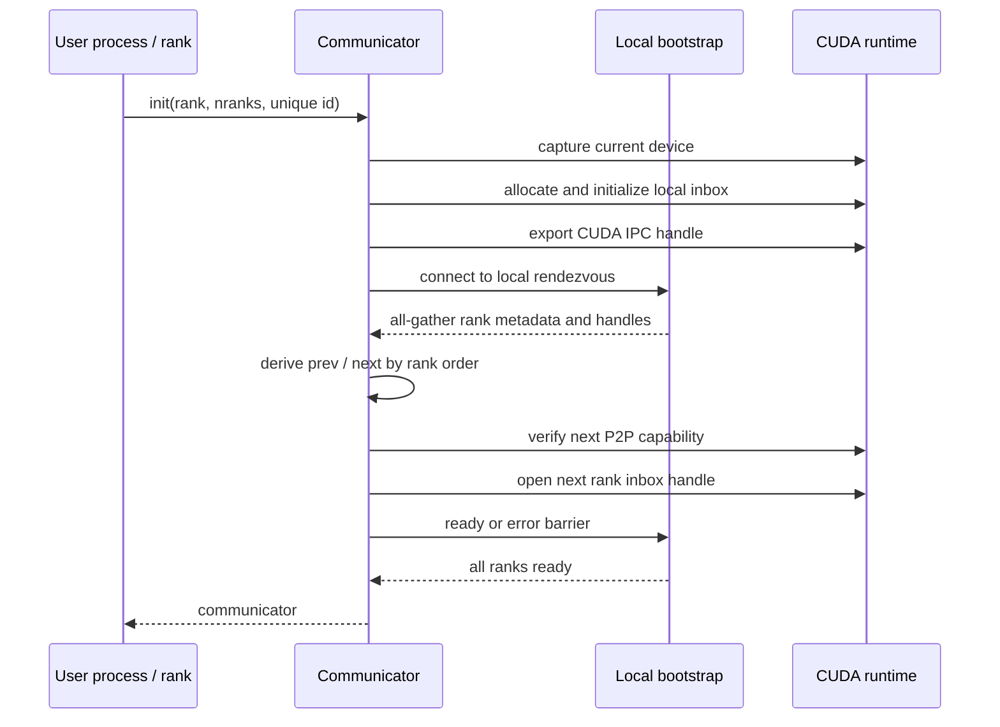

# tiny-nccl v0.1 设计

## 1. 目标

v0.1 回答一个问题：在单机多 GPU 上，一次 NCCL 风格的 AllReduce 是怎样从进程级 communicator 变成 GPU 间有界、异步的数据流的？

最小闭环固定为：

```text
单机 + 多进程 + 一 rank 一 GPU
FP32 SUM + AllReduce
Ring + 单 channel
CUDA IPC/P2P + GPU-resident bounded FIFO
```

这是一个教学实现，不承诺性能、ABI 或生产可用性。成功标准不是“接口像 NCCL”，而是端到端保留下面的机制：

```text
communicator -> bootstrap -> neighbor connection -> work
-> Ring Reduce-Scatter -> Ring All-Gather
-> FIFO credit/ready -> CUDA stream completion
```

## 2. 为什么选择这一条切片

AllReduce 同时覆盖 NCCL 最核心的三层：

- 控制面：rank 如何会合、交换 CUDA IPC handle、形成 ring。
- 调度面：主机如何把一个 collective 编码成 GPU work，并保持跨 rank 顺序一致。
- 数据面：GPU 如何在有限缓冲上执行 reduce、forward 和 flow control。

固定 `FP32 SUM`、Ring、单 channel 后，每一层只剩一个真实实现。此时再引入算法基类、transport factory、planner 或模板矩阵，只会把核心路径藏起来。

## 3. 系统边界

### 3.1 支持

- Linux、CUDA、同一主机的多个独立进程。
- 每个 rank 在调用初始化前选择自己的 CUDA device。
- rank 按整数顺序组成逻辑 ring：`prev=(rank-1+nranks)%nranks`，`next=(rank+1)%nranks`。
- 完全 in-place，或完全不重叠的 out-of-place buffer。
- 同一 communicator 上按同一 CUDA stream 串行提交 collective。
- 任意 `count`，包括不能被 rank 数和 tile 容量整除的尾块。

### 3.2 不支持

- 单进程多线程 rank、一个 rank 多 GPU、MIG 特殊处理。
- 多节点、Socket/RDMA 数据面、CPU staging fallback。
- P2P 不可达或不满足同步要求的 GPU 组合。
- 多个 host thread 并发调用同一 communicator。
- 不同 stream 交叉提交到同一 communicator。
- 多 datatype、多 reduction、多 collective、多算法或多 protocol。
- 拓扑搜索、channel 调优、注册缓存、CUDA Graph capture、group semantics。

## 4. 最小模块



建议物理文件保持扁平：

| 文件 | 唯一职责 | 对应 NCCL 概念 |
|---|---|---|
| `include/tnccl.h` | C 风格公开 API 与结果码 | public NCCL API |
| `src/internal.h` | 主机侧 POD 状态和内部声明 | `ncclComm` 的最小切片 |
| `src/bootstrap.cc` | 本机 rendezvous、元数据交换、barrier | bootstrap |
| `src/comm.cc` | 分配 mailbox、IPC handle 交换/打开、销毁 | init + P2P connector |
| `src/api.cc` | 参数校验、work 构造、kernel launch | enqueue 的最小切片 |
| `src/device.cuh` | slot、ticket、内存序和五个 primitive | SIMPLE primitives |
| `src/ring_allreduce.cu` | 唯一 kernel 与 Ring 两阶段 | device AllReduce |

如果实际实现能在不混淆职责的前提下合并相邻文件，可以合并；禁止为了匹配表格制造空壳。

## 5. 公开契约

公开 API 保持最小 C ABI，名称以实际头文件为准，语义如下：

```cpp
tncclResult tncclGetUniqueId(tncclUniqueId* id);
tncclResult tncclCommInitRank(
    tncclComm_t* comm, int nranks, tncclUniqueId id, int rank);
tncclResult tncclAllReduceSumF32(
    const float* send, float* recv, size_t count,
    tncclComm_t comm, cudaStream_t stream);
tncclResult tncclCommDestroy(tncclComm_t comm);
const char* tncclGetErrorString(tncclResult result);
```

关键语义：

- `tncclCommInitRank` 捕获当前 CUDA device；每个进程必须预先选择不同的目标 GPU。
- 第一次 AllReduce 将 communicator 绑定到传入 stream；后续不同 stream 调用被拒绝。
- AllReduce 返回成功只表示工作已排入 stream，不表示通信完成。可见结果由 CUDA stream/event 同步决定。
- send/recv buffer 必须存活到对应 stream 工作完成；绑定 stream 本身必须存活到 communicator 销毁返回。
- communicator 内的 collective 次序是协议的一部分；所有 rank 必须以相同顺序、相同 `count` 调用。
- `nranks>1` 时初始化和 destroy 都是 blocking collective，所有 rank 必须以同一 communicator 次序参与。
- destroy 会同步绑定 stream；随后第一道 rank barrier 保证所有 kernel 已结束，各 rank 关闭 imported IPC mapping，第二道 barrier 后才释放 exported local mailbox。因此 destroy 可能阻塞。
- 不支持的调用直接返回确定的错误，不静默回退到 CPU。
- v0.1 没有 GPU-visible abort；peer 退出或 collective 次序/`count` 不一致属于契约违反，可能永久等待，测试必须使用外部进程 timeout。

## 6. 初始化路径



bootstrap 只传控制元数据，不传 tensor payload。控制连接保留到 collective destroy，用于安全协调 CUDA IPC importer 先关闭、exporter 后释放；它不参与稳态 tensor 数据路径。bootstrap 阶段的 I/O 和 barrier 有有限超时，但 GPU steady-state wait 没有 abort 机制。

为了保持实现小，ring 顺序就是 rank 顺序。设备/rank 映射由调用方负责；若某条邻接边不支持所需 CUDA P2P 能力，初始化失败。

## 7. 主机提交路径

```text
tncclAllReduceSumF32
-> validate communicator, current device, stream and buffers
-> derive balanced segments and fixed-size tiles
-> assign one monotonically increasing operation/ticket range
-> construct one fixed-size device work descriptor
-> launch one single-channel kernel on the user stream
-> advance host sequence state
-> return without stream synchronization
```

这里没有 `Info -> Task -> Plan -> Batch`。只有一个 collective、算法、protocol 和 channel，CUDA stream 已经提供提交顺序；另建 host planner 是重复排队。

## 8. Ring 算法

将 `count` 个元素均衡分成 `P=nranks` 个 segment，长度差最多 1；每个 segment 再切成 mailbox payload 能容纳的 tile。所有 rank 以最大 segment 长度计算同一个 tile 数；即使 `count=0`，也执行一个零 payload 控制 tile。这样每个 collective 都推进 FIFO 状态，零长度操作之后的 ticket 不会在各 rank 间分叉。零长度 tile 不访问 tensor 地址。

对 rank `r`，每个 tile 执行：

```text
Reduce-Scatter
  send one local segment
  P-2 times: receive + local reduce + forward
  receive + local reduce + store the final owned segment

All-Gather
  send the owned reduced segment
  P-2 times: receive + local store + forward
  receive + final local store
```

设备侧只需要五种动作：

1. `sendLocal`
2. `recvReduceSend`
3. `recvReduceStore`
4. `recvCopySend`
5. `recvStore`

准确的 segment 轮转下标应集中在 kernel 的少量代码中，并由参考测试覆盖；不要创建通用 `Algorithm/Protocol/RedOp/Fan` 模板层。

`nranks == 1` 是 identity 快路径：在同一 stream 上完成必要的 device copy，in-place 时无需搬运。它只验证 API/stream 基础语义，不验证 ring。

## 9. 有界 FIFO 与内存序

每个 rank 拥有一个 GPU inbox，前驱写入它；本 rank 打开后继的 inbox，作为 outbox 写入。v0.1 固定每个 mailbox 为 4 个 slot，每个 slot 含固定容量 payload 和同步状态。通信占用约为：

$$
O(4 \times C)
$$

其中 $C$ 是每 slot 的 payload 大小；它不随输入 tensor 大小增长。

逻辑消息使用永不回退的单调 ticket `t`，物理槽为：

$$
i = t \bmod 4
$$

初始状态为：

$$
ready_i = 0, \qquad credit_i = i, \qquad i \in \{0,1,2,3\}
$$

精确协议为：

$$
\begin{aligned}
&\text{producer system-acquire waits for } credit_i=t \\
&\text{producer writes payload} \\
&\text{producer system-release publishes } ready_i=t+1 \\
&\text{consumer system-acquire waits for } ready_i=t+1 \\
&\text{consumer reads payload} \\
&\text{consumer system-release publishes } credit_i=t+4
\end{aligned}
$$

每个 tile 在每条 ring 边上经历 Reduce-Scatter 和 All-Gather，共计 $2(P-1)$ 个 ticket。因此 host 为一次 collective 预留并推进：

$$
\max(1,\text{tileCount}) \times 2(P-1)
$$

个 ticket。`P=1` 不使用 mailbox，因此增量为 0。

必须维持：

- producer 得到 credit 前不能覆盖 slot。
- consumer 看到 ready 前不能读取 payload。
- consumer 完成全部读取前不能归还 credit。
- payload 与 flag 之间使用 device/system scope 可证明的栅栏或 acquire/release 原语。
- `ready` 和 `credit` 各自保持单写者；不需要原子 read-modify-write。
- ticket 跨 collective 单调递增，避免旧 flag 被误认为新消息。
- 4 个 slot 是内部固定常量而非公开 API；它们给融合 recv-forward 留出流水与 credit 空间。

不要使用“反正 GPU 最终会看到”的经验性同步。v0.1 的教学价值恰恰在于把 buffer ownership、发布和回收写成可检查的不变量。

## 10. 错误与生命周期

- bootstrap 消息使用定长头和明确长度，所有 I/O 处理短读、短写和 peer 关闭。
- unique id 只定位一次 rendezvous，不承担安全认证；仅用于可信本机实验。
- 初始化采用分阶段清理：只销毁已创建或已打开的 CUDA 资源。
- 异步 kernel 错误最终通过 CUDA stream/device 的标准错误面暴露；同步的参数与 launch 错误由 API 返回。
- communicator destroy 成功返回后消费该 handle；调用后不得再次使用或重复销毁。其返回前必须保持绑定 stream 有效。
- destroy 无论成功或失败都会消费 host handle，不得重试。若控制连接或 CUDA device 状态使跨 rank 安全释放无法证明，实现宁可把 CUDA IPC allocation 保留到 CUDA context/进程退出，也不会提前释放仍可能被 peer 映射的内存。
- communicator 被销毁后所有 rank 都必须停止使用对应 IPC mailbox；destroy 的两次 barrier 负责正常路径的跨进程释放顺序。
- v0.1 不承诺运行中 peer failure 或 collective 契约违反能传播到 GPU wait loop；这类情况可能挂起，外部 harness 必须设置进程级 timeout。

## 11. 核心不变量

1. 所有 rank 对同一 collective 得出相同的 segment、tile 和 ticket 次序。
2. 同一 communicator 的 kernel 由同一 stream 串行化。
3. tensor 初始化后不经过 CPU 或 bootstrap socket。
4. mailbox 有界且复用，不能按 tensor 大小申请 staging buffer。
5. channel 数固定为 1；一个 CUDA block 承担这一 channel。
6. API 返回不等于 collective 完成。
7. 不支持的拓扑显式失败，不做隐藏 fallback。
8. bootstrap 控制面等待有超时；GPU steady-state 等待只有 collective 契约保证，不承诺 runtime abort。

## 12. 明确不预建

v0.1 不创建以下抽象：

- `Transport` 基类、factory 或 plugin registry
- algorithm/protocol registry 与成本模型
- topology graph/search
- `Info/Task/Plan/Batch` 对象链
- channel 容器与动态 channel 分配
- proxy thread
- generic datatype/reduction dispatch
- group scheduler 与 persistent work queue
- profiler、配置系统、RAS、RDMA registration cache

原因相同：每个维度当前只有一个实现。只有 v0.2 出现真实的 Socket 数据面后，才允许比较两条真实路径；即便如此，也先直接写清分支，不立即抽象。

## 13. v0.1 完成定义

- 源码和构建描述完整，在 CUDA 工具链环境可编译。
- 两个及以上进程分别绑定支持 P2P 的 GPU，AllReduce 结果与 CPU reference 一致。
- 覆盖 in-place/out-of-place、非整除 count、多 tile、连续多次 collective 和非默认 stream。
- 通信 buffer 大小固定，测试大 tensor 时不随输入扩张。
- 不支持的 device/rank/stream/topology 返回明确错误。
- sanitizer 或等价检查未发现 host 生命周期和越界问题。

初始实现环境没有 `cmake`、`nvcc` 和 GPU；仅纯 CPU Ring/ticket 模型用系统 C++ 编译器运行通过。CUDA 源码尚未编译，单卡和多卡均未验证，因此“代码已写完”不能等同于上述运行时完成定义；详见 [验证策略](validation.md)。
