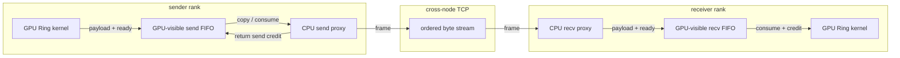

# tiny-nccl v0.2 设计

## 1. 目标与唯一增量

v0.2 在 v0.1 的单机 CUDA IPC/P2P Ring 之上，增加跨节点的 TCP Socket 数据面和一个可完整追踪的 CPU proxy 闭环。

仍然只做：

- 一 rank 一 GPU、多进程。
- `FP32 SUM AllReduce`。
- 固定 rank 顺序、单 channel Ring。
- 固定 tile 与有界 FIFO。

新增的学习问题只有一个：GPU 不能直接调用普通 Socket 时，CPU proxy 如何在 GPU work queue、host staging buffer、Socket 和 credit 之间推进通信？

## 2. 不是 transport framework 版本

v0.2 不先设计 `Transport` interface、factory、virtual method、capability matrix 或 plugin API。

理由：v0.1 的 P2P 是 GPU 直接 load/store；v0.2 的 Socket 是 CPU proxy 搬运，两者的 ownership、progress 和完成语义并不相同。过早强行统一，会得到最小公倍数接口，反而掩盖关键差异。

实现先保留两个明确分支：

```text
local ring edge  -> CUDA IPC/P2P direct path
remote ring edge -> mapped host FIFO + Socket proxy path
```

只有后续出现第三个真实数据面且重复结构稳定时，再从代码中提炼 connector 公共字段。

## 3. 架构



控制面与数据面分离：

- bootstrap 通过 TCP rendezvous 交换 rank、地址、device/node 标识，并建立逻辑 ring。
- 本机相邻 rank 继续使用 v0.1 CUDA IPC/P2P。
- 跨节点相邻边使用独立的长连接 TCP socket。
- proxy thread 只为跨节点边存在；本机 P2P 不绕 CPU。

v0.1 的 `tncclUniqueId` 内部编码本机 Unix socket 路径，不能直接跨节点复用。v0.2 实现前必须先确定一种最小 TCP rendezvous 定位方式，使所有 rank 获得 rank 0 的 host/port 和随机 communicator id；其具体编码仍待 TCP 实现设计，不在 v0.1 API 中提前固化。

## 4. 最小新增模块

在 v0.1 基础上新增的主要文件是：

| 文件 | 职责 | 不负责 |
|---|---|---|
| `src/net_socket.cc` | 建连、定长 framing、短读短写、关闭 | transport interface、自动重连、加密 |
| `src/proxy.cc` | send/recv progress loop、FIFO credit、线程生命周期 | 通用 scheduler、线程池、插件 |
| `src/proxy.h` | Socket 边所需的 POD 状态 | 继承层次、虚函数 |

这张表只列新增文件，不表示改动仅限于它们。v0.2 还必然修改 bootstrap、communicator/internal state、device FIFO/kernel 和构建描述。允许直接在 communicator 中保存 `edge is local/remote` 和对应状态。此处一个清楚的条件分支优于一个尚无稳定边界的抽象体系。

## 5. Socket 边的数据结构

每条跨节点 ring 边需要两个有界队列：

- GPU -> proxy 的 send FIFO：GPU 生产 payload，send proxy 消费并归还 credit。
- proxy -> GPU 的 recv FIFO：recv proxy 生产 payload，GPU 消费并归还 credit。

FIFO 使用 CUDA 可访问的 page-locked mapped host memory，或实现验证后确定的等价机制。选择标准不是峰值性能，而是 ownership 与内存可见性可以被明确证明。

send slot 还必须携带 `payloadBytes`。GPU 先写 payload 和实际字节数，再以 system-release 发布 ready；proxy 以 system-acquire 看到 ready 后才能读取两者。这样 tail/empty tile 不需要复制固定满槽，且 frame 长度有唯一来源。该字段是 Socket 路径的具体需求，不反向抽象成通用 transport descriptor。

每个 Socket frame 只携带恢复消息边界所需字段：

```text
ticket | payload bytes | payload
```

`magic/version` 在连接握手时交换一次；communicator、operation、phase 和 tile 都由该连接上下文与单调 ticket 推导，不在每帧重复。TCP 保证字节有序，不保证应用消息边界，因此长度是必需的。字段保持定长网络字节序；不加入压缩、checksum、协商或 extensible TLV。可信实验网络上的损坏/断连直接使 communicator 失败。

## 6. Proxy 教学闭环

### 6.1 发送方向

```text
GPU waits send-slot credit
-> GPU writes mapped-host payload
-> GPU publishes slot ready
-> send proxy observes ready
-> proxy writes one framed message to socket
-> socket write completes or fails
-> proxy returns slot credit
-> GPU may reuse the slot
```

send credit 只能在 proxy 不再读取 staging payload 后归还。一次 `write()` 可能只发送部分字节，proxy 必须保存 offset 并继续推进，不能提前回收 slot。

### 6.2 接收方向

```text
recv proxy waits for a free recv slot
-> proxy reads frame header and exact payload length
-> proxy writes mapped-host payload
-> proxy publishes slot ready
-> GPU observes ready
-> GPU reduce/copy/forward
-> GPU returns slot credit
-> proxy may reuse the slot
```

recv proxy 不能在 GPU 完成读取前覆盖 slot。GPU 与 CPU 之间的 flag 必须使用 CUDA/host 可证明的 system-scope 可见性，不使用普通非原子轮询制造 data race。

这两个方向共同构成 NCCL NET proxy 最值得理解的闭环：

```text
GPU produces/consumes <-> bounded FIFO <-> CPU progress <-> network
```

## 7. Progress 模型

- 每 rank 一个 proxy thread 足够；它同时推进最多一条远端 send 边和一条远端 recv 边。
- socket 使用 non-blocking I/O 加 `poll`/`epoll` 中最简单的一个，避免单方向阻塞饿死另一方向。
- progress loop 维护少量显式状态：当前 slot、header offset、payload offset、失败状态。
- 没有 work-stealing、线程池、callback graph 或 generic operation queue。
- idle 时阻塞等待 socket/stop 事件并适度轮询 GPU-visible flag；避免无条件占满一个 CPU core。

当任意 Socket I/O 或协议步骤失败，proxy 设置 communicator 的单调失败状态并唤醒 host 控制面。v0.2 不尝试透明重连；重连会破坏 collective 的全 rank 次序，应由上层整体重建 communicator。

与 v0.1 相同，v0.2 不承诺 GPU runtime abort：已经在 device FIFO 上等待 ready/credit 的 kernel 不保证观察到 host failure。peer 失败或协议破坏后，proxy/控制面应能检测并停止继续提交，但当前版本不承诺所有 GPU rank 自主退出；测试 harness 必须使用外部进程 timeout。若未来要提供这一保证，必须显式设计 GPU-visible、system-scope 的 abort word 和所有 wait loop 的检查点，而不能仅靠 host 状态。

## 8. 跨路径顺序不变量

1. 所有 rank 仍对同一 collective 生成相同 operation sequence、phase、step 和 tile 次序。
2. 本机 P2P 边与远端 Socket 边共享逻辑消息编号，但不强行共享物理 FIFO 结构。
3. proxy 只能处理当前预期 frame；乱序、重复或长度越界立即失败。
4. send slot 在 Socket 完全消费前不能返还给 GPU。
5. recv slot 在 GPU 完全消费前不能返还给 proxy。
6. 网络背压最终传导为 FIFO 无 credit，从而停住 GPU producer；不能申请无界 host buffer 绕开背压。
7. 正常 destroy 继承 v0.1 的 collective/blocking 和 stream-lifetime 语义：停止新提交，保持 proxy 运行直至绑定 stream 完成；第一道 rank barrier 后停止/join proxy、关闭 Socket 和 imported IPC mapping，第二道 barrier 后再释放 exported local mailbox 与 mapped memory。
8. runtime peer failure 能传播到 host proxy/control state，但不承诺唤醒已经等待 GPU flag 的 kernel；外部 harness 负责 timeout 和进程回收。

## 9. v0.2 仍不做

- RDMA/IB、GPUDirect RDMA、GPU-initiated networking。
- Socket 多 rail、多 connection striping、零拷贝优化。
- transport factory、plugin ABI、capability negotiation。
- 拓扑搜索、动态 ring 重排、多 channel。
- Tree/PAT/NVLS/CollNet 或其他 collective。
- LL/LL128 protocol、分片自适应、成本模型。
- fault recovery、elastic membership、安全认证与加密。

这些能力都不会帮助解释 v0.2 的核心闭环；加入它们会显著增加代码和验证面。

## 10. 完成定义

- 至少两个节点、每节点至少一张 GPU、多进程运行。
- ring 中确实存在跨节点边，并确认 tensor payload 经过 Socket proxy。
- AllReduce 与 CPU reference 一致，覆盖非整除、多 tile、连续 collective 和网络背压。
- 用小 Socket buffer 或受控延迟制造 partial I/O，FIFO 保持有界且无死锁。
- peer 关闭、frame 非法、proxy 停止能在有限时间内被相关 proxy/control path 检测，不泄漏 host 线程、Socket 或 staging buffer；GPU rank 的最终退出由外部 timeout 兜底。
- v0.1 的本机 P2P 验证继续通过。

当前无 GPU/多节点环境不具备 v0.2 动态验收条件；v0.2 只是后续实现参照，不属于 v0.1 交付范围。
